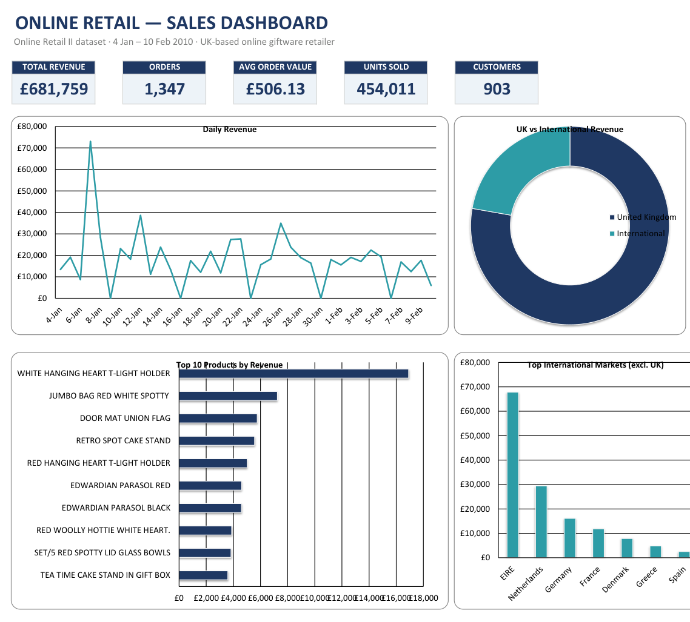

# Online Retail Sales Analysis

---

## Dashboard Previews

**Tableau**

**Excel**

> **Note:** The two dashboards intentionally cover different scopes. The Tableau dashboard analyzes the full dataset (500K+ transactions across two years, including peak holiday season), while the Excel dashboard drills into a single trading window (Jan 4 – Feb 10, 2010, ~30K transactions) with non-product entries such as postage and manual adjustments removed. This is why figures like the top 10 products differ between the two.

---

## Overview

**Objective:**
Analyze retail transaction data to understand key drivers of revenue and identify customer segments contributing most to overall sales performance.

This project analyzes 500K+ online retail transactions to uncover sales trends, customer behavior, and product performance using Excel and Tableau.

The analysis includes data cleaning, transformation, exploratory analysis, and dashboard visualization to generate actionable insights.

---

## Tools Used

* Excel (data cleaning, feature engineering, pivot tables, interactive KPI dashboard)
* Tableau (interactive dashboard and visualization)

---

## Key Insights

* Revenue peaks in November and December, indicating strong seasonal demand patterns
* The United Kingdom contributes a majority of total revenue, highlighting geographic concentration
* A small group of customers drives a large portion of total revenue, indicating high customer concentration
* Top-performing products are primarily gift and decorative items, suggesting consistent demand trends

---

## Files Included

* `online_retail_analysis.xlsx` → Data cleaning and pivot analysis
* `online_retail_dashboard.twbx` → Interactive Tableau dashboard
* `online_retail_excel_dashboard.xlsx` → Interactive Excel dashboard (KPI cards, daily revenue trend, top products, UK vs international split) — fully formula-driven
* `excel_dashboard_preview.png` → Excel dashboard screenshot
* `dashboard_preview.png` → Tableau dashboard screenshot

---

## Business Impact

* Revenue spikes in November and December — useful for planning inventory ahead of the holidays
* A small group of customers drives most of the revenue, so losing a few of them is a real risk
* Gift and decorative items are the consistent top sellers
* Most revenue comes from the UK, so the business is heavily dependent on one market
